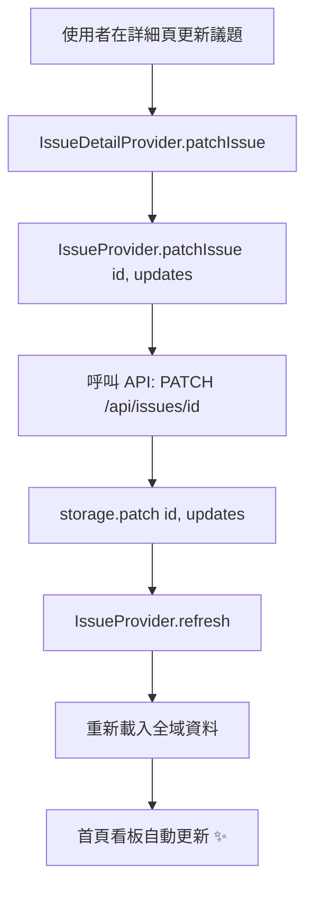

# React Kanban 看板系統

這是一個 Next.js 15 的一個簡單的看板系統（Kanban Board），用來展示現代 React 開發的核心概念與最佳實踐。

## 快速開始

1. **安裝依賴套件**

```bash
bun install
```

2. **啟動開發伺服器**

```bash
bun dev
```

3. **開啟瀏覽器**

前往 [http://localhost:3000](http://localhost:3000) 查看結果

## 專案結構

```
react-kanban/
├── src/
│   ├── app/                          # Next.js App Router 頁面
│   │   ├── layout.tsx                # 根 Layout，初始化全域狀態
│   │   ├── page.tsx                  # 首頁（看板介面）
│   │   ├── issues/
│   │   │   └── [id]/
│   │   │       ├── layout.tsx        # 議題詳細頁 Layout
│   │   │       └── page.tsx          # 議題詳細頁
│   │   └── api/
│   │       └── issues/
│   │           ├── route.ts          # 議題列表 API
│   │           └── [id]/route.ts     # 單一議題 API
│   ├── components/                   # React 元件
│   │   ├── providers/
│   │   │   ├── issue.tsx             # 全域議題狀態管理
│   │   │   └── issue-detail.tsx     # 單一議題狀態管理
│   │   ├── status-column.tsx         # 看板欄位元件
│   │   └── issue-card.tsx            # 議題卡片元件
│   ├── lib/
│   │   └── storage.ts                # 記憶體資料儲存
│   └── types/
│       └── issue.ts                  # 議題型別定義
```

## 核心概念

### 1. Server Component vs Client Component

```typescript
// ✅ Server Component（預設）
// src/app/layout.tsx
export default function RootLayout({ children }) {
  const initialIssues = storage.getAll(); // 可以直接存取伺服器資源
  return <IssueProvider initialIssues={initialIssues}>{children}</IssueProvider>;
}

// ✅ Client Component（需要使用 hooks）
// src/components/providers/issue.tsx
'use client';
export function IssueProvider({ children, initialIssues }) {
  const [issues, setIssues] = useState(initialIssues);
  // ...
}
```

### 2. Layout 的角色

Layout 會包住它底下的所有路由和元件：

```
/app/layout.tsx (根 Layout)
  └─ 提供 IssueProvider 給整個應用程式

/app/issues/[id]/layout.tsx (議題詳細 Layout)
  ├─ /app/issues/[id]/page.tsx (詳細頁)
  ├─ /app/issues/[id]/edit/page.tsx (編輯頁，未來可能新增)
  └─ 其他在這個路由下的頁面...
```

### 3. Context Provider 設計模式

這個專案使用雙層 Provider 架構：

```
<IssueProvider>                    # 全域狀態，管理所有議題
  ├─ 首頁看板
  └─ <IssueDetailProvider>         # 單一議題狀態，包裝全域方法
       └─ 議題詳細頁
```

**為什麼要分兩層？**

這個專案採用雙層 Provider 設計，主要有兩個原因：

首先，**外層的 `IssueProvider` 負責管理所有議題的全域狀態**。它提供的方法（如 `patchIssue(id, updates)`）都需要明確傳入議題 ID，因為它不知道你要操作哪一個議題。這個 Provider 適合用在需要操作多個議題的場景，例如首頁的看板介面。

其次，**內層的 `IssueDetailProvider` 提供型別安全的單一議題操作**。當你進入議題詳細頁時，Layout 會先從全域狀態中找出對應的議題。如果議題不存在（`issue === undefined`），Layout 會提前返回錯誤畫面，不會往下渲染。只有當議題確實存在時，才會將它傳給 `IssueDetailProvider`。這樣一來，在詳細頁中使用 `useIssueDetail()` 時，TypeScript 可以保證 `issue` 一定存在（非 `undefined`），不需要額外的空值檢查。同時，這個 Provider 包裝了全域方法，自動帶入當前議題的 ID，讓使用更方便（例如 `patchIssue(updates)` 而不用寫 `patchIssue(issue.id, updates)`）。

簡單來說：外層管理「全部」，內層管理「單一」並確保型別安全

```typescript
// 在首頁看板（使用全域 Provider）
const { patchIssue } = useIssue();
await patchIssue('issue-1', { status: 'done' }); // 需要傳 id

// 在議題詳細頁（使用詳細 Provider）
const { patchIssue } = useIssueDetail();
await patchIssue({ status: 'done' }); // 自動帶入當前議題的 id
```

### 4. 單一真相來源（Single Source of Truth）

所有資料都來自 `IssueProvider`，確保資料一致性：



### 5. 提前返回（Early Return）模式

在 Layout 中驗證資料存在，確保型別安全：

```tsx
// src/app/issues/[id]/layout.tsx
export default function IssueDetailLayout({ children, params }) {
  const { issues } = useIssue();
  const { id } = use(params);
  const issue = issues.find((issue) => issue.id === id);

  if (!issue) {
    return <ErrorUI />; // 提前返回
  }

  // 執行到這裡，TypeScript 知道 issue 一定存在
  return <IssueDetailProvider issue={issue}>{children}</IssueDetailProvider>;
}
```

## API 使用範例

### 取得所有議題

```http
GET /api/issues HTTP/1.1
Host: localhost:3000
```

**回應：**

```json
[
  {
    "id": "1",
    "title": "洗碗",
    "description": "昨天晚上的碗還沒洗...",
    "status": "todo"
  }
]
```

### 建立新議題

```http
POST /api/issues HTTP/1.1
Host: localhost:3000
Content-Type: application/json

{
  "title": "寫作業",
  "description": "微積分第三章習題",
  "status": "todo"
}
```

### 更新議題

```http
PATCH /api/issues/1 HTTP/1.1
Host: localhost:3000
Content-Type: application/json

{
  "status": "done"
}
```

### 刪除議題

```http
DELETE /api/issues/1 HTTP/1.1
Host: localhost:3000
```

## 技術棧

- **框架**：[Next.js 15](https://nextjs.org/) (App Router)
  React 全端框架，支援 Server Component 與 Client Component，提供檔案系統路由與內建 API 功能

- **語言**：[TypeScript](https://www.typescriptlang.org/)
  JavaScript 的超集合，提供靜態型別檢查，減少執行時期錯誤，提升開發體驗

- **UI 元件**：[shadcn/ui](https://ui.shadcn.com/)
  基於 Radix UI 的無樣式元件庫，可直接複製到專案中自由修改，不需額外安裝套件

- **樣式**：[Tailwind CSS](https://tailwindcss.com/)
  Utility-first CSS 框架，透過組合預定義的 class 快速建構介面，避免撰寫自訂 CSS

- **套件管理**：[Bun](https://bun.sh/)
  高效能的 JavaScript 執行環境與套件管理工具，比 npm/yarn 更快速

## 學習目標

通過這個專案，你將學會：

1. **Next.js 15 App Router**
   - **Server Component 與 Client Component 的差異**：理解哪些元件應該在伺服器端渲染（直接存取資料庫、檔案系統），哪些需要在客戶端執行（使用 hooks、處理互動事件）
   - **Layout 與 Page 的關係**：學習如何用 Layout 包裹多個頁面提供共用邏輯（如 Context Provider），以及 Layout 如何影響路由結構
   - **Route Handlers（API Routes）**：在 `app/api` 目錄下建立 RESTful API 端點，處理 GET、POST、PATCH、DELETE 等 HTTP 請求

2. **React 狀態管理**
   - **Context API 的使用**：透過 `createContext` 和 `useContext` 在元件樹中共享狀態，避免 props drilling（逐層傳遞）
   - **Provider 設計模式**：將狀態邏輯封裝在 Provider 元件中，提供清晰的 API 給子元件使用，實現關注點分離
   - **自訂 Hooks**：將可重用的邏輯抽取成 `useIssue`、`useIssueDetail` 等自訂 hooks，讓元件程式碼更簡潔

3. **TypeScript**
   - **介面定義（Interface）**：定義 `Issue` 介面描述資料結構，讓 IDE 提供自動完成與型別檢查
   - **型別安全的 CRUD 操作**：透過 TypeScript 確保傳入 API 的資料格式正確，在編譯時期就發現錯誤
   - **Utility Types（Omit, Partial）**：使用 `Omit<Issue, 'id'>` 建立不含 id 的型別（新增時），`Partial<Issue>` 建立所有欄位可選的型別（部分更新時）

4. **RESTful API**
   - **GET、POST、PATCH、DELETE 方法**：學習標準的 HTTP 動詞使用時機（GET 查詢、POST 新增、PATCH 部分更新、DELETE 刪除）
   - **錯誤處理**：使用適當的 HTTP 狀態碼（200 成功、404 找不到、500 伺服器錯誤）回應客戶端
   - **資料驗證**：在 API 端點驗證請求資料的完整性與正確性，防止不合法的資料寫入

5. **軟體架構**
   - **單一真相來源**：所有議題資料都由 `IssueProvider` 統一管理，任何修改都會同步更新，避免資料不一致
   - **關注點分離**：將資料儲存（storage.ts）、API 邏輯（route.ts）、狀態管理（providers）、UI 元件分開管理，提升可維護性
   - **元件組合**：透過組合小元件（IssueCard、StatusColumn）建構複雜介面，遵循 React 的組合優於繼承原則

## 建議學習順序

如果你是初學者，建議按照以下順序閱讀程式碼：

1. **先看資料結構**
   - [src/types/issue.ts](src/types/issue.ts) - 了解議題資料長什麼樣子

2. **理解資料儲存**
   - [src/lib/storage.ts](src/lib/storage.ts) - 看看資料是怎麼儲存和操作的

3. **學習 API 設計**
   - [src/app/api/issues/route.ts](src/app/api/issues/route.ts) - 列表 API
   - [src/app/api/issues/[id]/route.ts](src/app/api/issues/[id]/route.ts) - 單一議題 API

4. **掌握狀態管理**
   - [src/components/providers/issue.tsx](src/components/providers/issue.tsx) - 全域狀態管理
   - [src/components/providers/issue-detail.tsx](src/components/providers/issue-detail.tsx) - 單一議題狀態

5. **研究頁面結構**
   - [src/app/layout.tsx](src/app/layout.tsx) - 根 Layout，資料初始化
   - [src/app/page.tsx](src/app/page.tsx) - 首頁看板
   - [src/app/issues/[id]/layout.tsx](src/app/issues/[id]/layout.tsx) - 議題詳細 Layout
   - [src/app/issues/[id]/page.tsx](src/app/issues/[id]/page.tsx) - 議題詳細頁

6. **了解 UI 元件**
   - [src/components/status-column.tsx](src/components/status-column.tsx) - 看板欄位
   - [src/components/issue-card.tsx](src/components/issue-card.tsx) - 議題卡片

## 常見問題

### Q: 為什麼要用 'use client'？

A: 在 Next.js 15 App Router 中，元件預設是 Server Component。如果你需要使用 React hooks（useState、useContext 等）或瀏覽器 API，就必須在檔案開頭加上 `'use client'` 來標記為 Client Component。

### Q: Layout 和 Page 有什麼差別？

A:

- **Layout**：包住多個頁面的共用結構，不會在切換頁面時重新渲染
- **Page**：單一頁面的內容，切換頁面時會重新渲染

Layout 很適合放置 Context Provider，因為它可以為底下所有頁面提供共用狀態。

### Q: 為什麼不直接用 useState 管理資料？

A: 如果只在單一元件使用，useState 就夠了。但在這個專案中，多個元件需要共用議題資料（首頁看板、詳細頁面），使用 Context API 可以避免 props 一層層傳遞，程式碼更清晰。

### Q: 重啟伺服器後資料會消失嗎？

A: 會的！這個專案使用記憶體儲存，資料只存在於程式執行期間。這是刻意設計的，方便教學示範。未來可以改接資料庫來持久化資料。

## 進階練習

想要挑戰更多功能嗎？試試這些練習：

1. **新增議題編輯頁面**
   - 建立 `/app/issues/[id]/edit/page.tsx`
   - 實作表單驗證
   - 使用 `useIssueDetail()` 更新資料

2. **實作搜尋功能**
   - 在首頁新增搜尋框
   - 過濾顯示符合條件的議題

3. **新增議題標籤**
   - 擴充 Issue 型別，加入 `tags: string[]`
   - 支援多標籤篩選

4. **接入真實資料庫**
   - 安裝 Prisma
   - 建立 SQLite 資料庫
   - 改寫 storage.ts 使用資料庫

5. **新增使用者認證**
   - 使用 NextAuth.js
   - 每個議題關聯建立者
   - 只有建立者能編輯/刪除

## 相關資源

- [Next.js 官方文件](https://nextjs.org/docs)
- [React 官方教學](https://react.dev/learn)
- [TypeScript 手冊](https://www.typescriptlang.org/docs/)
- [shadcn/ui 元件庫](https://ui.shadcn.com/)

## 授權

MIT License - 可自由使用於教學與學習
